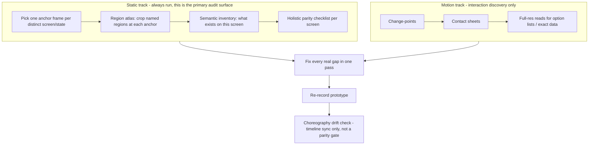

# Video Parity Audit

## What "parity" means here

Parity is **functional and structural**, not pixel-level:

| Accept | Reject |
|---|---|
| Correct element **roles** (a headline is a headline, a filter dropdown has the right options, a data table has the right rows) | Pixel-exact dimensions, spacing, or SSIM chased toward 1.0 |
| Correct **region placement** (logo above the profile tile, tabs under the title, sidebar on the right) | A HI/P component used just because the docs list it, even when it adds behavior/affordance the source doesn't have |
| HI/P's own default styling (colors, fonts, borders differing from the source's bespoke CSS) | Missing or misplaced functionality disguised as "close enough" |
| Content matching exactly (labels, option text, row data, counts) | Approximated or paraphrased content |

If you catch yourself justifying a gap with "the design system renders it that way," stop - that is exactly the failure mode this skill exists to prevent. See the **visual-role override rule** below.

## Why this exists

Two related problems, verified on this project:

1. **Motion-only tooling misses static chrome.** A wrongly-positioned sidebar logo and a page title with the wrong closed-state styling were both wrong from the very first frame onward. Neither ever "changed," so change-point detection and SSIM comparison - both built to catch *differences between frames* - had nothing to flag. They were declared parity-passed while visibly wrong the whole time.
2. **Manually guessing timestamps and reading one full-resolution frame at a time is expensive and unreliable.** A Term dropdown with real data was once declared "never opened in the video" simply because the wrong timestamps were sampled.

The workflow below runs **two tracks together**: a **static track** that forces a direct look at chrome/layout/region placement that never changes, and a **motion track** that uses scene-detection and contact sheets to efficiently find real interaction moments (dropdown opens, tab switches, panel appears).



## This is a mandatory, enforced process, not an optional checklist

This skill was rewritten twice after two different classes of repeat misses:

- **Content misses** (dropdown search boxes, missing default filter values, un-rendered checkbox labels, a table capped at 2 rows despite claiming "401 total results"). Cause: the audit was scoped to whatever had just been pointed out instead of being exhaustive.
- **Static chrome misses** (a sidebar logo floating in the wrong corner at the wrong size, a page title wrapped in a component that added an unwanted drop shadow). Cause: the audit was built entirely around change detection, which structurally cannot see something that is wrong on every frame, and around SSIM, which is too coarse to flag a small, local, always-present error.

Do not skip steps to save time - skipping is what caused both classes of repeat misses.

## Workflow

```
Task Progress:
- [ ] Step 1: Identify every distinct screen/state and pick one anchor timestamp per screen
- [ ] Step 2: Build a region atlas (static track) - readable crops of named regions at each anchor
- [ ] Step 3: Write a semantic inventory per screen - what exists, not what changed
- [ ] Step 4: Extract change-points and build contact sheets (motion track) for interaction discovery
- [ ] Step 5: Pull targeted full-resolution frames for interesting timestamps
- [ ] Step 6: Read real component contracts before asserting how anything behaves - apply the visual-role override rule
- [ ] Step 7: Run the full per-screen, all-element-type holistic checklist against the prototype
- [ ] Step 8: Fix every real gap in one pass, including data extrapolation and filter consistency
- [ ] Step 9: Re-render the prototype recording
- [ ] Step 10: Run the choreography drift check and fix anything it flags
```

### Step 1: Identify screens and anchors

Watch (or skim frames of) the whole video and list every distinct screen/state: each tab, each panel/dialog open state, each major view. For each, pick one representative timestamp where that screen is fully settled (no mid-transition animation). This list of `{ screenId, t }` anchors drives the static track - it is independent of, and comes before, change-point detection.

### Step 2: Region atlas (static track)

```bash
node scripts/build-region-atlas.js videos/original.mp4 <regions-config.json> .tmp/region-atlas
```

Given the anchors from Step 1 and a config of named region crops (e.g. `topNav`, `pageHeader`, `mainContent`, `rightSidebar` - in the source video's native pixel coordinates), writes one readable JPG per region per anchor to `.tmp/region-atlas/<screenId>/<region>.jpg`. Pure ffmpeg, zero AI-token cost.

Read every crop. This is the step that catches things like a misplaced logo or a title with the wrong closed-state styling - errors that are wrong on every frame and therefore invisible to change detection or SSIM. Do not skip this step because "nothing changed there" - that is precisely the case it exists to cover.

### Step 3: Semantic inventory

For each screen, write down what actually exists - not a diff, an inventory: regions present and their order, headline text and whether it's a plain heading vs. an interactive menu, tabs, filters/dropdowns and their default values, tables/charts and their approximate shape, sidebar tiles, logos/brand marks and where they sit. This is a page-understanding step. Do it before touching the prototype so you're comparing a real mental model of the screen, not a laundry list of isolated complaints.

### Step 4: Change-points and contact sheets (motion track)

```bash
node scripts/extract-changepoints.js videos/original.mp4
node scripts/build-contact-sheets.js videos/original.mp4 .tmp/changepoints/original.json
```

This track exists to efficiently find **interaction moments** - dropdown opens/closes, tab switches, panels appearing - not to audit static layout (that's Step 2's job).

`extract-changepoints.js` writes `.tmp/changepoints/original.json`, a list of `{t}` timestamps where the screen visibly changed. Default sensitivity (`0.003`) is tuned for desktop UI walkthroughs where dropdowns/panels only cover part of the screen.

**Do not use ffmpeg's typical scene-cut default (~0.02)** - it is tuned for full-frame video-editing cuts and silently misses partial-screen UI changes like a dropdown opening. Verified empirically: `0.02` produced zero change-points across a window known to contain multiple dropdown open/close events; `0.003` correctly caught them.

If a specific video is very noisy (e.g. a webcam bubble with a talking head covering part of the frame), raise the threshold incrementally and re-check that known interaction windows are still captured before trusting the result.

`build-contact-sheets.js` writes grid images to `.tmp/contact-sheets/sheet-NN.jpg` (default 30 tiles per sheet, 6 columns) plus `manifest.json` mapping every grid tile, in row-major order, to its exact source timestamp. Each tile is a vertical pair: the top half is the normal full-frame thumbnail (context), the bottom half is an auto-cropped, upscaled "what changed" region (via `diff-region.js`, ffmpeg `blend=difference` + `bbox`, zero AI-token cost). Check both halves of every tile. A blank gray bottom half means ffmpeg found no region above the diff threshold, not necessarily "nothing happened" - pull it at full resolution (Step 5) if that seems surprising.

Read each sheet with the Read tool - one image read covers ~30 moments. Look for state changes and note the approximate tile position, then look up its exact timestamp in `manifest.json`.

### Step 5: Targeted full-resolution reads

For each timestamp worth reading precisely:

```bash
ffmpeg -ss <t> -i videos/original.mp4 -vframes 1 -vf scale=1000:-1 out.jpg
```

Read `out.jpg`. If text is still too small (e.g. a dropdown's option list), crop tighter before scaling:

```bash
ffmpeg -ss <t> -i videos/original.mp4 -vframes 1 -vf "crop=W:H:X:Y,scale=1000:-1" out.jpg
```

Crop coordinates are in the source video's native resolution (check with `ffprobe -v error -select_streams v:0 -show_entries stream=width,height -of csv=p=0 <video>`), not the scaled-down coordinates of any earlier screenshot.

### Step 6: Read real component contracts - and know when to override them

Before building or asserting anything about any UI category (tables, grids, lists, charts, metrics, cards, tags, avatars, empty states, flyouts, accordions, progress indicators, layout columns - anything), inventory **all five HIP documentation namespaces** in the local design cache - not just `@eab-eip`:

```
/Users/dennisbest/Library/Application Support/Cursor/User/globalStorage/eab-hip.hip-designer/kb-design-cache/kb-design/ds/markdown/
  @eab-eip  — form/nav/basic elements (hi-*)
  @eab-vip  — visualization components (vi-grid, vi-list, vi-table, vi-tree, vi-metric, vi-columns, vi-funnel, vi-renderer)
  @eab-yip  — styling mixins (yi-table, yi-card, yi-layout, yi-view-state, yi-hover, …)
  @eab-dip  — design helpers
  @eab-xip  — sitemap helpers
```

**Mandatory routing before building:**
- Data table with sort icons, row checkboxes, bulk Actions → **`vi-grid`** (`@eab-vip/vi-grid/visual_guide.md`), NOT bare `<table kind="compact">` (`@eab-yip/yi-table` is styling-only - borders/density, no sort/selection).
- Activity/history feed list → **`vi-list mode="item"`** (`@eab-vip/vi-list`).
- KPI/stat tile row → **`vi-metric`** or documented successor (`@eab-vip`).
- Category/tag chips → **`hi-tag-group` / `hi-tag`** (`@eab-eip/hi-tag`).
- Empty/placeholder states → **`yi-view-state`** (`@eab-yip/yi-view-state`).
- Progress bars → **`hi-meter`** (`@eab-eip/hi-meter`); `hi-progress-bar` is not a documented tag.
- Avatar rows → **`hi-avatar layout-inline`** (`@eab-eip/hi-avatar`).
- Collapsible term/section blocks → **`hi-accordion`** (`@eab-eip/hi-accordion`).
- Multi-column layouts → **`yi-layout` `l-size` grid** (`@eab-yip/yi-layout`).
- Charts → **`vi-chart`** if a cached contract or working example exists (check `@eab-vip` examples under `kb-design/ds/examples/visualizations/`). If `vi-chart` does not render or has no local contract, build a flagged custom SVG/HTML fallback and note the gap - do not silently substitute a table or skip the chart.

Per-component contracts live at `.../markdown/@eab-<namespace>/<component>/visual_guide.md`.

**Visual-role override rule (new):** HIP is a toolkit, not a ceiling *or* a floor. If a documented component's behavior matches what's on tape, use it. But if the *only* documented way to make something interactive brings along visual affordance the source doesn't have - e.g. wrapping a plain page-title headline in `hi-flyout` to make it clickable, which adds a drop-shadowed anchor state the source never shows - **do not use it as-is**. Build the closed-state appearance with plain HTML/CSS to match the source's actual look (a heading + a caret icon, no shadow, no background), and reserve the documented component (or a minimal custom toggle) for the open/expanded state only. Note the deviation informationally; it does not block continuing.

This is a correction to the previous version of this rule, which flatly said "page-title dropdown menus → `hi-flyout`." That rule caused a real miss on this project: a Staff Home page title picked up an unwanted drop shadow purely because `hi-flyout`'s default anchor styling was applied without checking whether it matched the source's plain-headline appearance.

Two more failure modes this section prevents, both of which happened on this project:
- Treating `hi-select[allow-key-search]` as "a visible search box" (it's actually silent keyboard type-ahead - no visible input). The real documented component for a visible search input with grouped/headed options is `hi-combobox`, using `input='[{"title":...,"value":...}, {"title":"Heading","heading":true}, ...]'`.
- Assuming `<hi-checkbox>Some Label</hi-checkbox>` renders a visible label from its slotted text. It does not - `hi-checkbox`'s shadow DOM has no slot for it. The documented pattern is a separate sibling `<hi-label for="...">` (wrap both in `hi-input-group layout-mode="input-label"` for horizontal layout).

**Render-test anything ambiguous** instead of trusting doc prose alone: render both candidate variants locally with Playwright, screenshot the relevant state, and compare against the matching video frame. Concrete example: docs describe `hi-select[aesthetic="dropdown"]` as having "no visual indicator" for the selected option, but a render test showed it actually does highlight the selected item by default - settled by evidence, not by re-reading the prose more carefully.

**Known hidden-tab rendering bug**: a `hi-select` with `selected-index="0"` + `<hi-option selected>` mounted inside an initially-`hidden` `hi-case` (any tab that isn't the default active one) silently fails to display its closed-state label text. This is NOT fixable by re-triggering clicks/opens after the fact. The robust fix: use `mode="value"` with an explicit `value="..."` attribute (and `value="..."` on each `<hi-option>`) instead of `selected-index`/`selected`.

### Step 7: Full per-screen, all-element-type holistic checklist

Do not scope the audit to "the thing that was just complained about." For every screen/state found in Step 1, check every element type present, against both the region atlas (Step 2) and the matching video frame(s):

- **Regions and layout structure**: sections present/absent, ordering, panel placement, panel-relative positioning (e.g. a logo sits *above* a profile tile in normal document flow, not absolutely positioned into a corner).
- **Headlines vs. interactive title menus**: does the closed state look like plain text (+ a caret if it opens something), or has a component's default styling added chrome the source doesn't have?
- **Interactive controls** (dropdowns/selects/comboboxes): search input present? selected-item highlighted? grouped/headed options? exact option text/order, including real duplicates? if it's a filter over a table/list/chart, does the default selection and the data shown agree (see filter-consistency rule)?
- **Tables**: exact columns, sort affordances, row data, pagination - extrapolate additional rows if a count/pager implies more than are directly visible (see data rule).
- **Charts**: chart type, axes, data shown - not a placeholder table where the video shows a chart, or vice versa.
- **Icons/logos**: real brand marks vs. generic icons, and correct size/position, not just "present somewhere in the HTML" (see brand-asset rule).
- **Text/labels/counts**: exact copy, not paraphrased or approximated.
- **Images/photos**: matches what's in the video where identity matters.

**Data rule**: where the video directly shows data, copy it exactly - don't paraphrase or "clean it up," including apparent glitches like real duplicate entries. Where the UI *implies* more data exists than is directly visible, extrapolate enough additional plausible rows/items to back that implied scale, using the visible entries as the template.

**Filter-consistency rule**: a dropdown/toggle/tab that filters a table/list/chart is not decorative - its default selected value and the data shown beneath it must agree, and if the video shows the filter changed to a different value producing different results, the prototype's data should differ too. Audit the control and the data it filters as one unit.

**Real brand assets rule**: if a visible element looks like an organization/product logo or brand mark - as opposed to a generic UI icon - never approximate it with the closest stock icon. Flag it per the discrepancy protocol and ask for the actual asset file before implementing anything. Concrete example from this project: an institution logo above a profile picture was implemented as `hi-icon kind="account_balance"` instead of being flagged - the fix was `hi-image src=".../real-logo.png"`. Once you do have the real asset, still verify its **placement and size** against the region atlas - having the right file in the wrong spot is the same class of miss with a different symptom (this also happened on this project: the correct logo asset was used but pinned to the wrong corner at the wrong size).

### Step 8: Fix every real gap in one pass

Fix everything found in Step 7 together, not one complaint at a time.

### Step 9: Re-render

Re-run the prototype's recording script to produce a new prototype video.

### Step 10: Choreography drift check (not a parity gate)

```bash
node scripts/compare-videos.js videos/original.mp4 videos/prototype.mp4 .tmp/changepoints/original.json .tmp/compare-videos/report.json
```

This computes an SSIM similarity score per change-point via pure ffmpeg - zero AI-token cost. **It is a relative drift/heuristic tool, not a parity pass/fail gate.** A prototype using a different design system than the source app will typically score ~0.65-0.75 even on a frame that is functionally perfect - don't chase the score toward 1.0, and never treat "SSIM looks fine" as evidence that static chrome is correct (it structurally cannot detect that - see Step 2).

Use it for exactly one thing: **spotting timeline/tab-sequencing drift**. A cluster of consecutive low scores across a whole stretch (rather than one isolated frame) means the recording script's assumed choreography no longer matches the source video's actual order - pull full-resolution frames from both videos at a couple of timestamps in that stretch to confirm before fixing anything. Ignore isolated outliers and t≈0 low scores (fade-in/unstyled-content flash) by default.

## Efficiency notes

- 25fps video over ~500s is ~12,500 raw frames. Change-point detection typically reduces this to a few hundred meaningful moments for the motion track - but the static track (Step 2) runs on a much smaller, fixed set of one-anchor-per-screen crops, independent of that count.
- Reading one 30-tile contact sheet costs roughly what reading one normal single-frame screenshot costs, not 30x that.
- `diff-region.js`, `build-region-atlas.js`, and `compare-videos.js` are all pure-ffmpeg, zero-AI-token tools - they can run freely. Reserve token-costing image reads for the region atlas, contact-sheet triage, and the handful of full-resolution reads those flag as needing a closer look.
