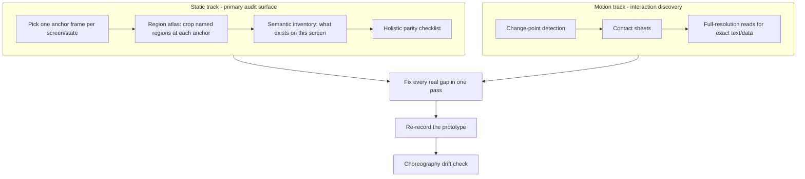

# Video Parity Audit: what it is and how it works

This document explains, in plain language, the process this repo uses to check that a HI/P static prototype (a file in `demos/`) actually matches a screen-recording video of the real product it's based on. The enforced, agent-facing version of this process lives in [.cursor/skills/video-parity-audit/SKILL.md](../.cursor/skills/video-parity-audit/SKILL.md) — this document is the human-readable companion to that.

## What "parity" means here

Parity is **functional and structural, not pixel-level**. The goal is that:

- a headline in the video is a headline in the prototype
- a dropdown that has real options in the video has the same real options in the prototype
- a table that shows certain columns and rows in the video shows the same columns and rows (or a reasonable extrapolation, when the video implies more data than it fully shows) in the prototype
- regions are in the right place — a logo sits where the video shows it, a sidebar is on the side the video shows it on

It explicitly does **not** mean matching to the pixel: 15 pixels of extra width on a dropdown, a slightly different font, or HI/P's own default colors and spacing showing through instead of the source app's bespoke styling are all fine. The prototype is built from a different design system (HI/P) than the real product, so it will never look pixel-identical, and chasing that is the wrong goal.

## Why this needed rewriting

The process originally grew around two automated tools — scene-change detection and SSIM (structural similarity) frame comparison — because those catch a specific, real problem well: interaction moments (a dropdown opening, a tab switching) that are easy to miss if you're just guessing timestamps to look at.

But both of those tools share a blind spot: **they can only detect something that changes, or something that differs between two specific frames.** Two real bugs slipped through repeatedly because of this:

1. An institution logo was pinned to the wrong corner of the sidebar at the wrong size, on every single frame from the start of the video onward.
2. A page title ("Staff Home") was wrapped in a dropdown-menu component that added a drop shadow around it in its closed state — again, present on every frame.

Neither of these ever "changed," so change-point detection had nothing to flag. And because the two design systems already differ in normal styling, a small, local, always-present error like this doesn't move an SSIM score far enough to stand out from ordinary background noise. The tools were structurally incapable of catching this class of bug — no amount of re-running them would have found it.

The fix is not to abandon those tools (they're still the efficient way to find interaction moments), but to run a **second, independent track** whose entire job is to look directly at static chrome and layout, whether or not anything "changed" there.

## The two tracks



**Static track** — runs once per distinct screen/state in the video, regardless of whether anything ever changes there. Crops out named regions (top nav, page header, main content, right sidebar) at full resolution so an agent can directly verify things like logo placement and title styling. This is the track that catches the two bugs described above.

**Motion track** — the original scene-detection pipeline, still useful for its original purpose: efficiently finding the handful of interaction moments (dropdown opens, panel appears, tab switches) in a long video without reading every single frame.

Both tracks feed into one combined checklist and one fix pass — they are not run or reported separately to you.

## Tooling map

All scripts live in [scripts/](../scripts/). All are pure ffmpeg (or ffmpeg + Node glue) with zero AI-token cost — they can be run freely; only the resulting images cost tokens to read.

| Script | Track | What it does |
|---|---|---|
| [build-region-atlas.js](../scripts/build-region-atlas.js) | Static | Given a video and a small JSON config of named region crops + anchor timestamps (one per screen), writes one readable JPG per region per screen. This is the new tool that closes the gap described above. |
| [extract-changepoints.js](../scripts/extract-changepoints.js) | Motion | Runs ffmpeg scene-change detection tuned for partial-screen UI changes (dropdowns, panels) and writes a list of timestamps where something visibly changed. |
| [build-contact-sheets.js](../scripts/build-contact-sheets.js) | Motion | Packs dozens of change-point timestamps into grid "contact sheet" images (thumbnail + auto diff-crop per tile), so one image read can triage ~30 moments at once. |
| [diff-region.js](../scripts/diff-region.js) | Motion | Given two timestamps, computes and crops out exactly the pixels that changed between them — used internally by `build-contact-sheets.js`, and usable standalone for a specific before/after pair. |
| [compare-videos.js](../scripts/compare-videos.js) | Neither (drift check) | Scores SSIM similarity between the original and re-recorded prototype video, per change-point. Used **only** to catch timeline/choreography drift after a re-record — not as a parity gate. See below. |
| [record-walkthrough.js](../scripts/record-walkthrough.js) | — | Drives a Playwright recording of the prototype, timed to match the verified timeline of the original video, producing `videos/prototype.mp4`. |

## The checklist

For every distinct screen/state identified in the video, an audit checks:

- **Regions and layout structure** — sections present, in the right order, in the right relative position (e.g., a logo sits above a profile tile in normal flow, not floated into a corner).
- **Headlines vs. interactive title menus** — does a clickable page title look like plain text with a small caret, or has some component added chrome (shadow, background, border) the source doesn't have?
- **Interactive controls** — dropdowns/selects/comboboxes: correct options, correct default selection, and if the control filters a table/chart, that the data shown actually matches the selected filter.
- **Tables and charts** — correct columns, correct data (or a plausible extrapolation when the UI implies more rows than are directly visible), correct chart type.
- **Logos and brand marks** — the real asset, in the right place, at the right size — not just "an image tag exists somewhere in the HTML."
- **Text, labels, and counts** — exact copy, not paraphrased.

## When to override the design system

HI/P (the design system this prototype is built from) is a toolkit, not a rulebook that overrides what's actually on screen. If the only documented way to make something interactive brings along visual affordance the source doesn't have, don't use it as-is.

**Canonical example from this project:** the "Staff Home" page title needed to be clickable (it opens a small menu with a "Professor Home" link). The design system's flyout/dropdown-menu component was used to satisfy that requirement — but its default closed-state styling added a drop shadow around the title that the real product never shows. The fix was to build the closed state with plain HTML/CSS (a heading plus a caret icon, no shadow, no background) and use a minimal custom toggle for the open state, rather than accepting the component's default chrome just because it was the "documented" way to add a dropdown.

The rule going forward: match what the video actually shows first; use the design system's components to implement that, not to dictate it.

## What the SSIM comparison is (and isn't) for

`compare-videos.js` produces a similarity score between the original and prototype video at every detected change-point. It is useful for exactly one thing: **spotting timeline drift** after re-recording the prototype — a stretch of several consecutive low scores in a row usually means the recording script's assumed step timing (which tab is active at second N, etc.) has fallen out of sync with the real video's order.

It is explicitly **not** a parity pass/fail gate:

- The prototype's design system differs from the source app's, so even a functionally perfect frame typically scores around 0.65–0.75, never close to 1.0.
- It cannot detect anything that's wrong on every single frame (a misplaced logo, wrong title styling) — those don't show up as "different" relative to anything, so they never register as an outlier.
- A clean report from this script is not evidence that static layout is correct. Only the region-atlas (static track) review is evidence of that.

## Typical workflow, start to finish

```bash
# Static track
node scripts/build-region-atlas.js videos/original.mp4 config/regions.json .tmp/region-atlas
# → read every crop in .tmp/region-atlas/

# Motion track
node scripts/extract-changepoints.js videos/original.mp4
node scripts/build-contact-sheets.js videos/original.mp4 .tmp/changepoints/original.json
# → read the contact sheets in .tmp/contact-sheets/

# Fix every real gap found by both tracks in one pass, editing demos/navigate-app.html

# Re-record and check for timeline drift only
node scripts/record-walkthrough.js
node scripts/compare-videos.js videos/original.mp4 videos/prototype.mp4 .tmp/changepoints/original.json .tmp/compare-videos/report.json
# → look only for consecutive-low-score clusters (drift), not the absolute score
```
